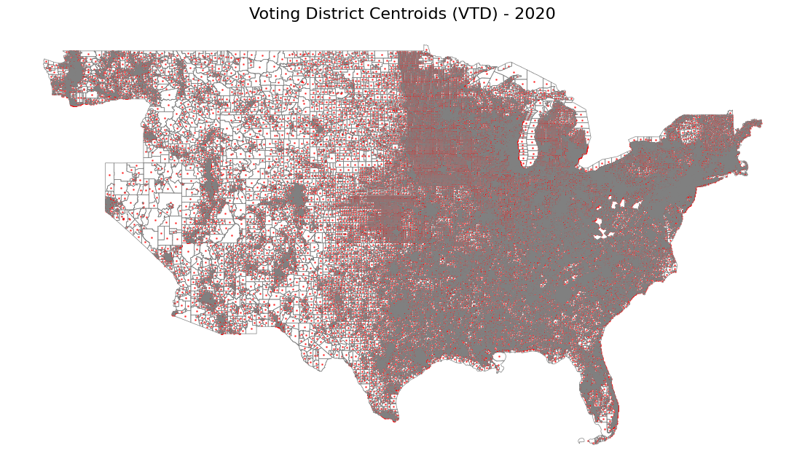
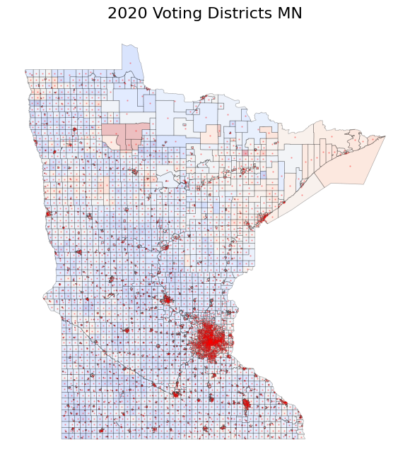
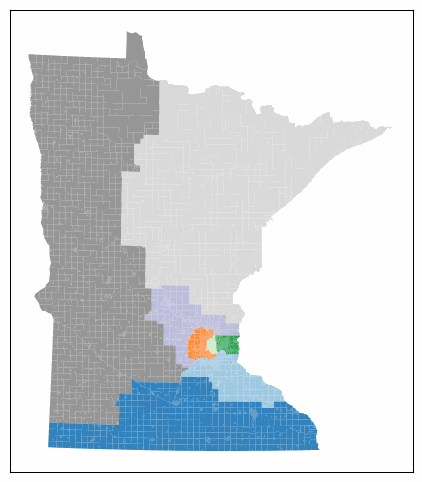
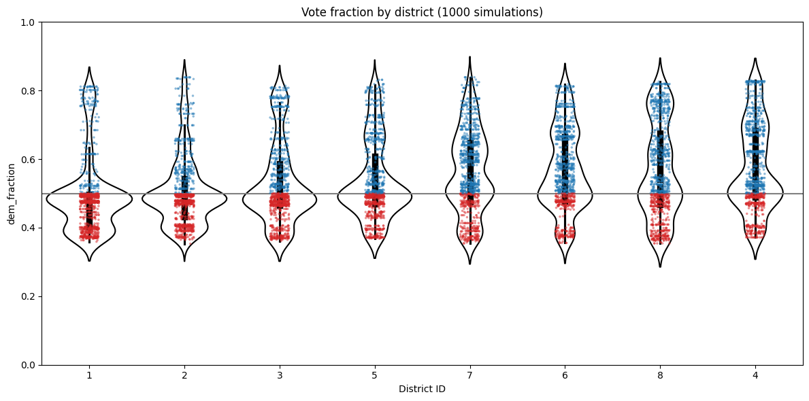

# Cellmander
Spatial gerrymandering test for robust cell typing and cell segmentation

# Data
### Voting district data from 2020 Census 
Hawaii and Alaska are omitted from the plot to preserve map contiguity. California and Oregon opted out of voting district data reporting. Their districts can be constructed from census block level data. Red points indicate geographical centroid of each voting district.

### Voting record data from the ALARM project

# Results
Minnesota 6 district proposal. 1000 `ReCom` MCMC steps, sampled at 5 step intervals

Simulated election outcomes using 2020 Presidential Election vote counts

# References
* [ALARM Project](https://alarm-redist.org/): curation of US voting district maps & analysis
* Friedman and Holden, 2008. [Optimal Gerrymandering in a Competitive Environment](https://web.mit.edu/rholden/www/papers/Competitive%20Gerrymandering.pdf). 
* DeFord, Duchin, and Solomon, 2019. [Recombination: A family of Markov chains for redistricting](https://arxiv.org/abs/1911.05725).
* `gerrychain`: MCMC-based districting package. [[docs](https://gerrychain.readthedocs.io/en/latest/)]

# TODO:
1. ~~implement `ReCom` based MCMC sampling on voting using the [GerryChain](https://gerrychain.readthedocs.io/en/latest/) implementation.~~
2. implement `ReCom` on sample ST data
3. GPU speedup of `ReCom` if no package is available
4. Gene count vector based reweighing of partitions 
